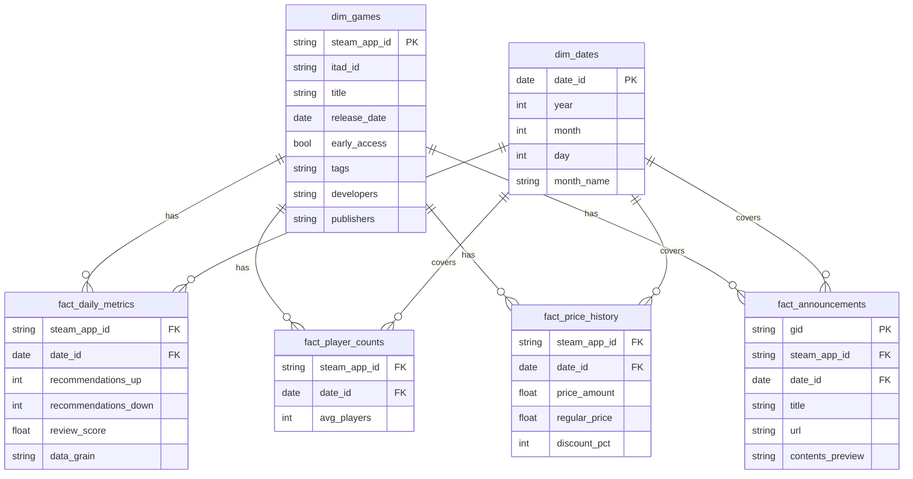
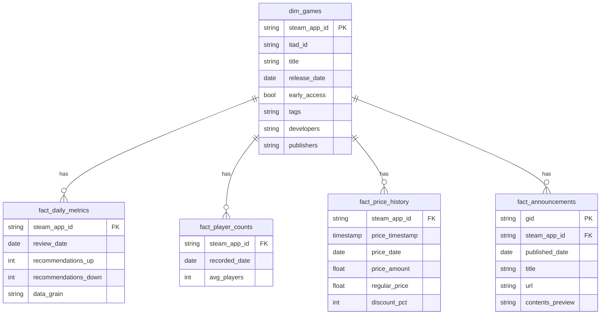

V.1 Initial draft

```mermaid
erDiagram
  dim_games {
    string steam_app_id PK
    string itad_id
    string title
    date release_date
    bool early_access
    string tags
    string developers
    string publishers
  }
  dim_dates {
    date date_id PK
    int year
    int month
    int day
    string month_name
  }
  fact_daily_metrics {
    string steam_app_id FK
    date date_id FK
    int recommendations_up
    int recommendations_down
    float review_score
    string data_grain
  }
  fact_player_counts {
    string steam_app_id FK
    date date_id FK
    int avg_players
  }
  fact_price_history {
    string steam_app_id FK
    date date_id FK
    float price_amount
    float regular_price
    int discount_pct
  }
  fact_announcements {
    string gid PK
    string steam_app_id FK
    date date_id FK
    string title
    string url
    string contents_preview
  }
  dim_games ||--o{ fact_daily_metrics : has
  dim_games ||--o{ fact_player_counts : has
  dim_games ||--o{ fact_price_history : has
  dim_games ||--o{ fact_announcements : has
  dim_dates ||--o{ fact_daily_metrics : covers
  dim_dates ||--o{ fact_player_counts : covers
  dim_dates ||--o{ fact_price_history : covers
  dim_dates ||--o{ fact_announcements : covers
```

V.2 Current Model Used

```mermaid
erDiagram
  dim_games {
    string steam_app_id PK
    string itad_id
    string title
    date release_date
    bool early_access
    string tags
    string developers
    string publishers
  }
  fact_daily_metrics {
    string steam_app_id FK
    date review_date
    int recommendations_up
    int recommendations_down
    string data_grain
  }
  fact_player_counts {
    string steam_app_id FK
    date recorded_date
    int avg_players
  }
  fact_price_history {
    string steam_app_id FK
    timestamp price_timestamp
    date price_date
    float price_amount
    float regular_price
    int discount_pct
  }
  fact_announcements {
    string gid PK
    string steam_app_id FK
    date published_date
    string title
    string url
    string contents_preview
  }
  dim_games ||--o{ fact_daily_metrics : has
  dim_games ||--o{ fact_player_counts : has
  dim_games ||--o{ fact_price_history : has
  dim_games ||--o{ fact_announcements : has
```
