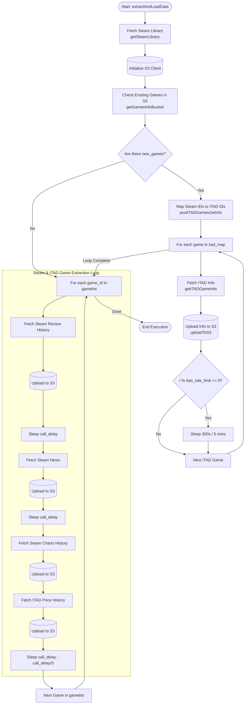

```mermaid

flowchart TD
    start([Start: extractAndLoadData]) --> get_steam[Fetch Steam Library<br/>getSteamLibrary]
    get_steam --> s3_init[(Initialize S3 Client)]
    s3_init --> check_bucket[Check Existing Games in S3<br/>getGamesInfoBucket]
    
    check_bucket --> has_new{Are there new_games?}
    
    %% New Games Branch
    has_new -- Yes --> map_itad[Map Steam IDs to ITAD IDs<br/>postITADGamesGetInfo]
    map_itad --> loop_new[For each game in itad_map]
    
    loop_new --> get_itad_info[Fetch ITAD Info<br/>getITADGameInfo]
    get_itad_info --> upload_itad_info[(Upload Info to S3<br/>uploadToS3)]
    upload_itad_info --> check_rate{i % itad_rate_limit == 0?}
    
    check_rate -- Yes --> sleep_5m[Sleep 300s / 5 mins]
    check_rate -- No --> next_new_game[Next ITAD Game]
    sleep_5m --> next_new_game
    
    next_new_game --> loop_new
    
    %% Main Extraction Loop
    has_new -- No --> loop_main[For each game_id in gamelist]
    loop_new -- Loop Complete --> loop_main
    
    subgraph Main_Extract_Loop [Steam & ITAD Game Extraction Loop]
        loop_main --> get_reviews[Fetch Steam Review History]
        get_reviews --> up_reviews[(Upload to S3)]
        up_reviews --> delay1[Sleep call_delay]
        
        delay1 --> get_news[Fetch Steam News]
        get_news --> up_news[(Upload to S3)]
        up_news --> delay2[Sleep call_delay]
        
        delay2 --> get_charts[Fetch Steam Charts History]
        get_charts --> up_charts[(Upload to S3)]
        
        up_charts --> get_price[Fetch ITAD Price History]
        get_price --> up_price[(Upload to S3)]
        up_price --> delay3[Sleep call_delay - call_delay/3]
    end
    
    delay3 --> next_main[Next Game in gamelist]
    next_main --> loop_main
    
    loop_main -- Done --> finish([End Execution])
```
