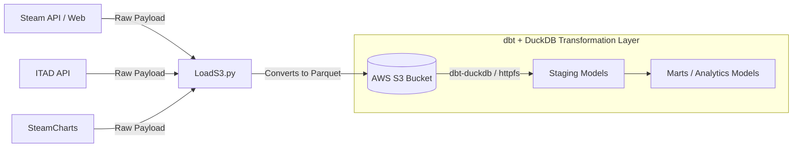

# Steam Library Player Sentiment Pipeline

>**Dashboard Link: https://steamlibrarysentiment-dashboard.streamlit.app/

An ELT data pipeline designed to analyze consumer sentiment (review spikes and active player counts) in response to game events (patch releases, major announcements, and historical sales).

---

## 1. High-Level Concept

This project extracts raw data from multiple endpoints (from Steam to SteamCharts and IsThereAnyDeal (ITAD)), loads the raw payloads into an AWS S3 bucket, and transforms the data using **dbt** with **DuckDB**.



### Research Goal
The pipeline investigates how external events, such as official developer updates or steep price discounts, impact player engagement and review distributions. 

> **Case Study:** Prompted by the announcement of *Dragon's Dogma 2's* expansion on June 9, 2026, which produced a visible surge in player counts and positive sentiment, this pipeline automates the cross-checking of similar events across an entire Steam game library.

---

## 2. Core Architecture & Design Choices

* **Personal Portfolio & Stack Mastery:** Designed as a hands-on project to demonstrate cloud storage patterns, rate-limited ingestion logic, and modern OLAP modeling.
* **dbt + DuckDB:** Selected for its zero-copy S3/Parquet querying capabilities via the DuckDB `httpfs` extension, allowing lightweight, local analytical transformations without provisioning heavy cloud warehouse infrastructure.
* **Raw Payload Retention:** Data is landed directly in AWS S3 as Parquet files to allow backfilling and schema updates without needing to re-query external APIs.

### Rate-Limiting Strategy
To prevent IP bans or HTTP `429 Too Many Requests` status codes during batch extractions, defensive pauses (`time.sleep`) are implemented across all scripts:

| Source API / Endpoint | Implemented Rate Limit | Strategy / Notes |
| :--- | :--- | :--- |
| **ITAD API** | 100 to 1,000 calls/min | Dependent on API key tier; enforced via fixed batch intervals. |
| **Steam Official API** | ~45 calls/min | Conservative delay strategy to remain well under undisclosed limits. |
| **Steam Storefront / Charts** | Throttled polling | Uses dynamic `CALL_DELAY` to mimic browser traffic and avoid scraping blocks. |

---

## 3. Repository & Module Structure

```text
SteamLibrarySentiment/
├── scripts/
│   ├── extract/
│   │   ├── ExtractITAD.py          # IsThereAnyDeal API integrations
│   │   ├── ExtractSteam.py         # Steam API and web scraping integrations
│   │   └── ExtractSteamCharts.py   # Historical concurrent player data extractions
│   └── load/
│       └── LoadS3.py               # Payload-to-Parquet conversion & S3 uploader
├── transform/                      # dbt project root
│   ├── models/
│   │   ├── staging/                # Views over raw S3 Parquet files
│   │   │   ├── sources.yml
│   │   │   ├── stg_itad_gameinfo.sql
│   │   │   ├── stg_itad_pricehistory.sql
│   │   │   ├── stg_steam_news.sql
│   │   │   ├── stg_steam_reviews.sql
│   │   │   └── stg_steamcharts_players.sql
│   │   └── marts/                  # Analytics-ready dimensional & fact tables
│   │       ├── schema.yml
│   │       ├── dim_games.sql
│   │       ├── fact_announcements.sql
│   │       ├── fact_daily_metrics.sql
│   │       ├── fact_player_counts.sql
│   │       └── fact_price_history.sql
│   ├── dev.duckdb                  # Local DuckDB target database
│   └── dbt_project.yml             # dbt configuration settings
├── Doc/                            # Documentation assets & diagrams
├── logs/                           # Execution logs
├── Main.py                         # Primary pipeline orchestrator entrypoint
└── .env                            # Local environment variables (Git ignored)
```

### Module Breakdown

#### `scripts/extract/`
* **`ExtractSteam.py`**: Fetches user library (`IPlayerService`), historical review histograms (`/appreviewhistogram/`), and developer-only news updates (`/ISteamNews/`).
* **`ExtractITAD.py`**: Resolves Steam AppIDs to ITAD UUIDs and extracts game metadata, early access tags, and historical pricing data.
* **`ExtractSteamCharts.py`**: Scrapes historical concurrent player count chart data.

#### `scripts/load/`
* **`LoadS3.py`**: Accepts raw JSON/dict payloads, normalizes and serializes them into compressed **Parquet** format locally, then streams the files directly to designated paths in AWS S3.

#### `scripts/Main.py` (extractAndLoadData)
* The primary pipeline orchestrator. Handles script execution, rate-limit sleep counters, and game lookup checks against existing S3 records.

#### `transform/` (dbt + DuckDB)
* **`staging/`**: Maps external S3 Parquet datasets to initial dbt views using DuckDB's `httpfs` extension, standardizing timestamps and column naming.
* **`marts/`**: Builds star-schema dimensions (`dim_games`) and key business facts (`fact_announcements`, `fact_player_counts`, `fact_daily_metrics`, `fact_price_history`) to cross-analyze sentiment against market incidents.akdown


---

## 4. Setup & Environment Variables

### Prerequisites & Dependencies
Python **3.10+** is recommended. Core libraries used:
* **Storage & Cloud:** `boto3`, `botocore`
* **Transformations:** `dbt-core`, `dbt-duckdb`, `duckdb`
* **Utilities:** `requests`, `python-dotenv`, `pandas`

Install all required dependencies using a `requirements.txt` file:
```bash
pip install -r requirements.txt
```

### Environment Configuration (`.env`)
Create a `.env` file in the project root directory with the following keys:

```ini
# API Keys
STEAM_API_KEY=your_steam_api_key_here
STEAM_ID=your_64bit_steam_id_here
ITAD_API_KEY=your_itad_api_key_here

# Pipeline Execution Settings
CALL_DELAY=1.5
ITAD_RATE_LIMIT=100

# AWS S3 Configuration
AWS_ACCESS_KEY_ID=your_aws_key_id
AWS_SECRET_ACCESS_KEY=your_aws_secret_key
AWS_S3_BUCKET_NAME=your_bucket_name
AWS_REGION_NAME=your_region_name
```

---

## 5. Execution Flow

### Ingestion Phase (Extract & Load)

Fetches data from all configured sources and writes raw Parquet files to S3:

bash

```bash
python scripts/Main.py
```

### Transformation Phase (dbt + DuckDB)

Runs staging and mart models against the raw S3 data via DuckDB:

bash

```bash
cd transform
dbt run
```

To validate data quality after transforming:

bash

```bash
dbt test
```

#### Orchestration Architecture

The pipeline is split across two scheduling systems, each handling a distinct phase:

|Phase|Tool|Schedule|Notes|
|---|---|---|---|
|**Extract & Load**|AWS Lambda + EventBridge|Saturdays, 02:00 UTC|Serverless, triggered by cron rule|
|**Transform**|GitHub Actions|Saturdays, 03:30 UTC|90-min buffer after EL completes|

##### Design Decision: Why Not a Single AWS-Native Solution?

An early attempt was made to containerize the dbt transformation layer inside a Docker image deployed as a second AWS Lambda function, keeping the full pipeline within the AWS ecosystem. This approach was abandoned due to:

- Lambda's read-only filesystem conflicting with dbt's requirement to write intermediate artifacts (`target/`, `dbt_packages/`)
- Unreliable execution of `dbt-core` in Lambda environments, both via subprocess calls and the programmatic Python API
- Significant packaging complexity for a tool designed as a CLI application

**GitHub Actions** was selected as the transformation orchestrator instead. It provides a full Linux environment with a writable filesystem, runs `dbt` as a standard CLI command, and copies the resulting `prod.duckdb` to S3 via the AWS CLI. This approach trades full AWS-native architecture for operational simplicity and reliability, which is the correct tradeoff at this scale.

## 6. Known Issues & Roadmap

- [x] **Automated orchestration** — EL and transformation phases currently run manually. Planned: two chained AWS Lambda functions triggered weekly via EventBridge, replacing the local execution steps above.
- [x] **Full library scale** — pipeline validated against a 3-game sample. Scaling to full Steam library (~180 titles) pending orchestration completion.
- [x] **Streamlit dashboard** — transformation layer complete, dashboard build in progress.

- Free-to-play games are excluded from price history tracking. ITAD does not maintain deal history for games with no purchase price. These games still appear in the pipeline's game list but are silently skipped during ITAD enrichment.
- Most delisted games, playtests, and technical test builds are filtered at library ingestion to prevent API errors on unavailable store pages.
- SteamCharts does not track all games. Titles with very low player counts or older releases may have no data, and are skipped gracefully.

**Scaling & Debugging Notes:**

- Initial full-library seeding (~187 games) runs close to Lambda's 15-minute execution limit. Weekly steady-state runs are significantly faster as ITAD enrichment only triggers for new purchases.
- Steam's undocumented rate limits on storefront endpoints require conservative request pacing; aggressive polling triggers connection resets and temporary IP blocks.
- Empty API responses (price history or player counts returning `[]`) must be guarded against at extract time to prevent malformed Parquet files that break downstream dbt models.